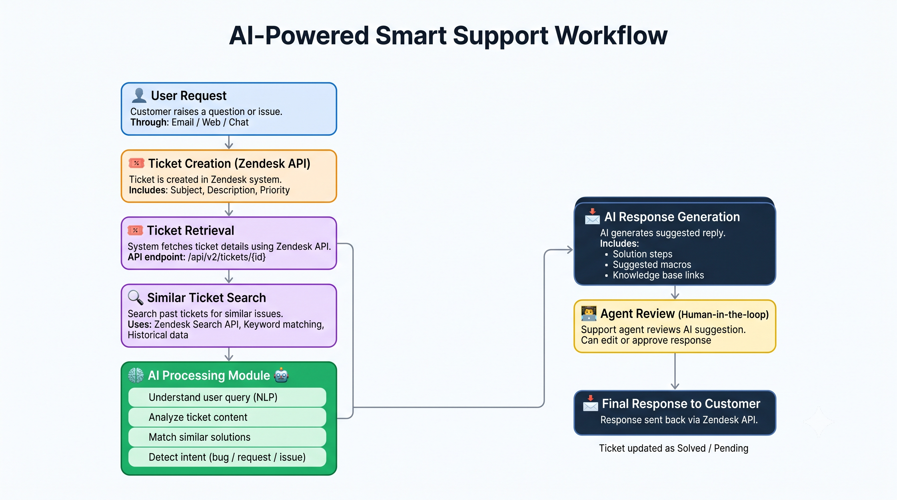
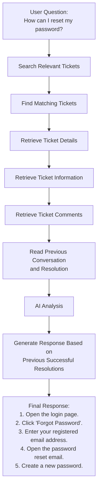
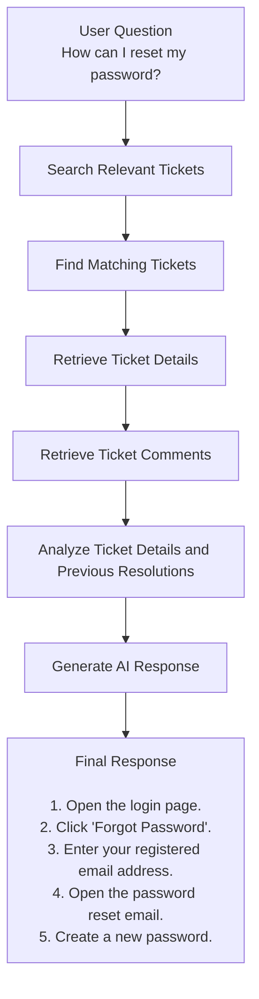

# AI Workflow

## Overview

The Smart Support Assistant uses Zendesk APIs to retrieve historical support information and assist users with accurate responses. Instead of directly answering a user's question, the AI searches for relevant support tickets, retrieves ticket details and comments, analyzes the information, and generates a response based on previous resolutions.

---

## AI Workflow Diagram

The following diagram illustrates the AI-powered workflow used by the Smart Support Assistant.



---

## Step 1 - Search Relevant Tickets

### Purpose

Search Zendesk for tickets that are relevant to the user's question.

### Input

- User question
- Keywords extracted from the question

### API Used

```
GET /api/v2/search.json?query={search_query}
```

### Output

- Matching ticket IDs
- Ticket subjects
- Basic ticket information

---

## Step 2 - Retrieve Ticket Details

### Purpose

Retrieve complete information for each relevant ticket.

### Input

- Ticket ID

### API Used

```
GET /api/v2/tickets/{ticket_id}.json
```

### Output

- Ticket Subject
- Description
- Status
- Priority
- Requester
- Assignee
- Tags
- Created Date
- Updated Date

---

## Step 3 - Retrieve Ticket Comments

### Purpose

Retrieve the conversation history of the selected ticket.

### Input

- Ticket ID

### API Used

```
GET /api/v2/tickets/{ticket_id}/comments.json
```

### Output

- Customer comments
- Agent replies
- Resolution steps
- Troubleshooting information

---

## Step 4 - AI Response Flow

### Purpose

Generate a helpful response using the collected ticket information.

### AI Process

1. Read ticket details.
2. Read ticket comments.
3. Understand the issue.
4. Identify previous successful resolutions.
5. Generate a clear response for the user.

### Final Output

A natural-language response based on historical Zendesk support data.

---

## Example Workflow



## Error Handling

| Scenario | Action |
|----------|--------|
| No matching tickets found | Inform the user that no relevant tickets were found. |
| Ticket not accessible | Skip the ticket and continue with other matching tickets. |
| Authentication failure | Return authentication error and stop the workflow. |
| API rate limit exceeded | Wait and retry the request after the specified interval. |
| Network failure | Retry the request or notify the user of the failure. |

---

## Best Practices

- Search for relevant tickets before retrieving ticket details.
- Retrieve comments only for relevant tickets.
- Handle API errors gracefully.
- Respect Zendesk API rate limits.
- Avoid exposing sensitive customer information.
- Use resolved tickets to improve response accuracy.
- Log API requests and responses for troubleshooting.
- Keep the workflow modular for future enhancements.

---

## Workflow Summary


