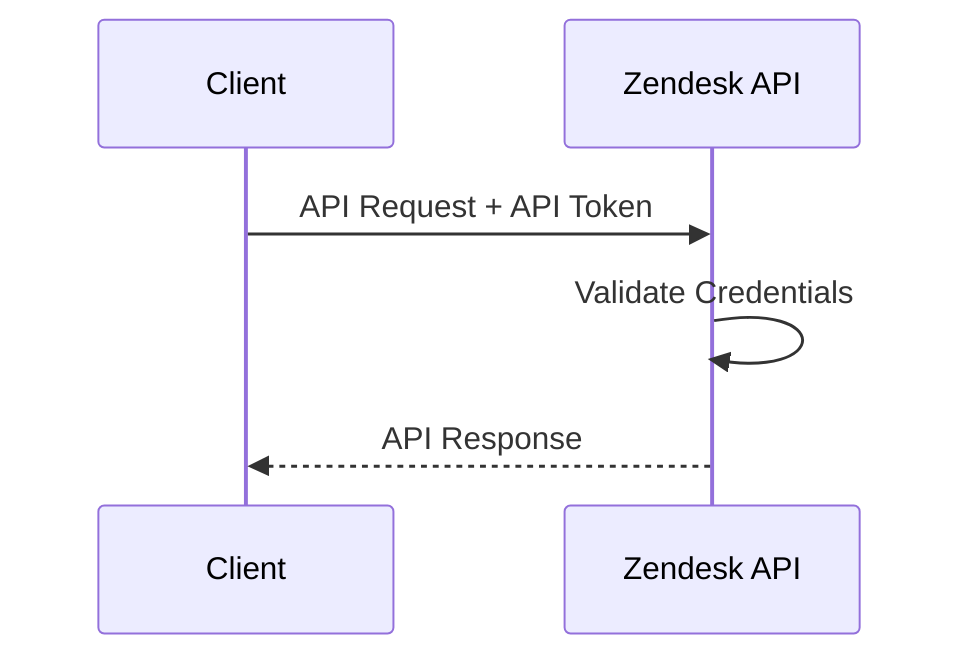

# Authentication

## Overview

The Smart Support Assistant uses the Zendesk REST API for all operations. Every API request must be authenticated using a Zendesk API Token.

Authentication ensures that only authorized users can access and manage support resources.

---

## Zendesk Environment

| Property | Value |
|---|---|
| Zendesk Domain | `https://own-48441.zendesk.com` |
| API Base URL | `https://own-48441.zendesk.com/api/v2` |
| Authentication Type | Basic Authentication with API Token |

---

## Authentication Flow


---  

## Authentication Method

Zendesk supports multiple authentication methods. This project uses:

* Basic Authentication with API Token

The credentials consist of:

* Zendesk Email Address
* API Token

---

## Authentication Format

The username must include `/token` after your email address.

```text
Email: your-email@example.com/token
Password: your_api_token
```

These credentials are Base64 encoded and sent in the `Authorization` header.

---

## Required HTTP Headers

Every API request should include the following headers:

| Header        | Value                               |
| ------------- | ----------------------------------- |
| Authorization | Basic Base64(email/token:api_token) |
| Content-Type  | application/json                    |
| Accept        | application/json                    |

---

## Example HTTP Request

```http
GET /api/v2/tickets.json HTTP/1.1
Host: your-subdomain.zendesk.com
Authorization: Basic <Base64EncodedCredentials>
Content-Type: application/json
Accept: application/json
```

---

## Using Postman

To authenticate in Postman:

1. Open your request.
2. Select the **Authorization** tab.
3. Set **Type** to **Basic Auth**.
4. Enter:

   * **Username:** `your-email@example.com/token`
   * **Password:** `your_api_token`
5. Postman automatically generates the Authorization header.

---

## Security Best Practices

Follow these recommendations to keep your API credentials secure:

* Never commit API tokens to Git repositories.
* Store credentials in Postman Environments.
* Use environment variables instead of hardcoding values.
* Regenerate API tokens if they are exposed.
* Grant only the minimum required permissions.

---

## Common Authentication Errors

| HTTP Status Code | Description                                                                      |
| ---------------- | -------------------------------------------------------------------------------- |
| 401 Unauthorized | Invalid email address or API token.                                              |
| 403 Forbidden    | The authenticated user does not have permission to perform the requested action. |

---

## Next Step

After authentication is configured, proceed to the **[API Overview](api-overview.md)** to understand the available API categories and endpoints.

 
