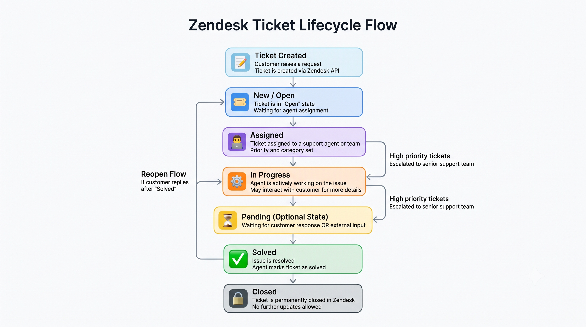

# Ticket APIs

## Base URL
https://own-48441.zendesk.com/api/v2

## Authentication
All APIs use Basic Authentication.

Format:
email/token + API Token

Example:
email/token:API_TOKEN

---

# Tickets

## Ticket Lifecycle

The following diagram illustrates the lifecycle of a support ticket in the Smart Support Assistant and Zendesk.



The ticket progresses through the following stages:

1. Ticket Created
2. Open
3. Assigned
4. In Progress
5. Pending (if waiting for customer or external input)
6. Solved
7. Closed

---

## Create Ticket

### Method
POST

### Endpoint
/tickets.json

### Full URL
https://own-48441.zendesk.com/api/v2/tickets.json

### Description
Creates a new support ticket in Zendesk.

### Headers
Content-Type: application/json  
Authorization: Basic Auth

### Request Body
```json
{
  "ticket": {
    "subject": "Login issue",
    "comment": {
      "body": "I cannot login to my account"
    },
    "priority": "high"
  }
}
```

### Response
```json
{
  "ticket": {
    "id": 12345,
    "subject": "Login issue",
    "status": "open"
  }
}
```

---

## Get Ticket by ID

### Method
GET

### Endpoint
/tickets/{ticket_id}.json

### Full URL
https://own-48441.zendesk.com/api/v2/tickets/{ticket_id}.json

### Description
Fetch a ticket using ticket ID.

### Path Params
- ticket_id: ID of the ticket

### Response
```json
{
  "ticket": {
    "id": 123,
    "subject": "Issue"
  }
}
```

---

## List Tickets

### Method
GET

### Endpoint
/tickets.json

### Full URL
https://own-48441.zendesk.com/api/v2/tickets.json

### Description
Returns list of all tickets.

### Query Params (Optional)
- page
- per_page

### Response
```json
{
  "tickets": [
    {
      "id": 1,
      "subject": "Issue 1"
    }
  ]
}
```

---

## Update Ticket

### Method
PUT

### Endpoint
/tickets/{ticket_id}.json

### Full URL
https://own-48441.zendesk.com/api/v2/tickets/{ticket_id}.json

### Description
Updates an existing ticket.

### Request Body
```json
{
  "ticket": {
    "subject": "Updated issue",
    "priority": "urgent"
  }
}
```

### Response
```json
{
  "ticket": {
    "id": 123,
    "subject": "Updated issue"
  }
}
```

---

## Delete Ticket

### Method
DELETE

### Endpoint
/tickets/{ticket_id}.json

### Full URL
https://own-48441.zendesk.com/api/v2/tickets/{ticket_id}.json

### Description
Deletes a ticket permanently.

### Response
```json
{
  "success": true
}
```

---

## Get Ticket Comments

### Method
GET

### Endpoint
/tickets/{ticket_id}/comments.json

### Full URL
https://own-48441.zendesk.com/api/v2/tickets/{ticket_id}/comments.json

### Description
Retrieves all comments for a ticket.

### Response
```json
{
  "comments": [
    {
      "id": 1,
      "body": "First comment"
    }
  ]
}
```

---

## Add Ticket Comment

### Method
POST

### Endpoint
/tickets/{ticket_id}/comments.json

### Full URL
https://own-48441.zendesk.com/api/v2/tickets/{ticket_id}/comments.json

### Description
Adds a comment to a ticket.

### Request Body
```json
{
  "comment": {
    "body": "Adding additional information",
    "public": true
  }
}
```

### Response
```json
{
  "comment": {
    "id": 987,
    "body": "Adding additional information"
  }
}
```

---

## Upload Attachment

### Method
POST

### Endpoint
/uploads.json?filename=test.png

### Full URL
https://own-48441.zendesk.com/api/v2/uploads.json?filename=test.png

### Description
Uploads a file attachment.

### Headers
Content-Type: multipart/form-data

### Response
```json
{
  "upload": {
    "token": "abc123"
  }
}
```

---

## Get Ticket Metrics

### Method
GET

### Endpoint
/ticket_metrics.json

### Full URL
https://own-48441.zendesk.com/api/v2/ticket_metrics.json

### Description
Returns ticket performance metrics.

### Response
```json
{
  "ticket_metrics": [
    {
      "id": 1,
      "ticket_id": 123
    }
  ]
}
```

---

## Error Responses

### 401 Unauthorized
Invalid or missing API token

### 404 Not Found
Ticket not found

### 400 Bad Request
Invalid request data