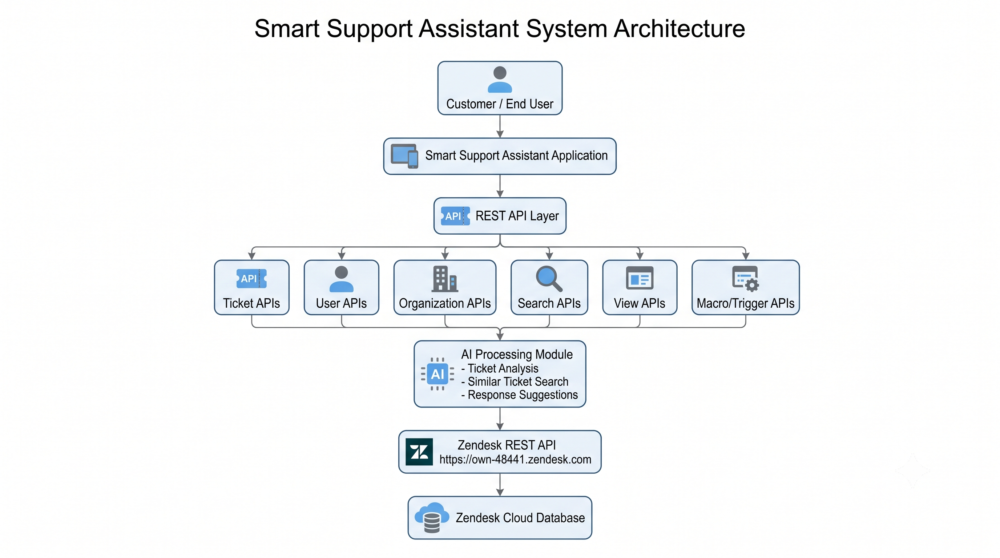

# Architecture

## Overview

The Smart Support Assistant follows a REST-based client-server architecture. It acts as an intermediary between client applications and the Zendesk REST API. The assistant receives requests from clients, validates authentication, forwards the requests to Zendesk, and returns the responses.

This architecture provides a secure, scalable, and maintainable way to integrate with Zendesk services.

---

## Architecture Diagram

The following diagram illustrates the high-level architecture of the Smart Support Assistant.

---

## Architecture Components

### Client Application

The client application sends HTTP requests to the Smart Support Assistant. It can be a web application, mobile application, or another backend service.

### Smart Support Assistant

This component acts as the central processing layer. It performs authentication, validates requests, communicates with the Zendesk REST API, and returns responses to the client.

### Zendesk REST API

The Zendesk REST API exposes endpoints for managing support resources such as tickets, users, organizations, views, macros, and triggers.

### Zendesk Platform

The Zendesk platform stores customer support data and executes the requested operations before returning responses.

---

## Request Flow

The request flow is as follows:

1. The client application sends an HTTP request.
2. The Smart Support Assistant validates the request.
3. Authentication credentials are verified.
4. The request is forwarded to the Zendesk REST API.
5. Zendesk processes the request.
6. A response is returned to the Smart Support Assistant.
7. The Smart Support Assistant returns the response to the client.

---

## Design Principles

The architecture is designed with the following principles:

* RESTful communication
* Secure authentication
* Modular design
* Scalability
* Maintainability
* Reusability
* Clear separation of responsibilities

---

## Benefits

This architecture offers several benefits:

* Easy integration with Zendesk APIs.
* Simplified API communication.
* Centralized authentication.
* Improved maintainability.
* Better scalability for future enhancements.
* Support for AI-assisted workflows.

---

## Next Step

The next document explains how authentication works using Zendesk API Tokens and how to securely access the Smart Support Assistant APIs.
 
