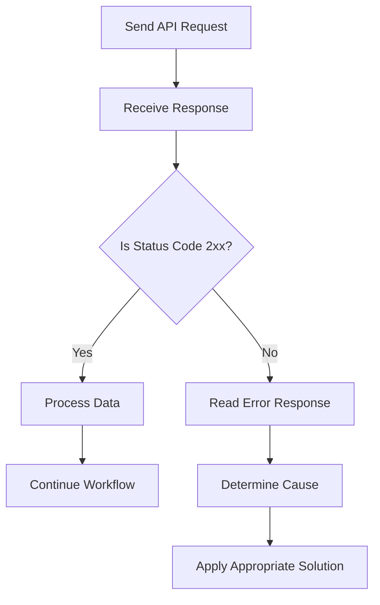

# Error Handling

## Overview

This document describes the common errors that may occur while using the Smart Support Assistant APIs and explains how to identify and handle them.

Proper error handling helps applications provide meaningful feedback to users and improves system reliability.

---

# Error Response Format

When an API request fails, Zendesk returns an HTTP status code along with a JSON response containing details about the error.

Example:

```json
{
  "error": "RecordNotFound",
  "description": "Not found"
}
```

---

# Common HTTP Status Codes

| Status Code | Meaning | Description |
|-------------|---------|-------------|
| 200 | OK | The request completed successfully. |
| 201 | Created | A new resource was created successfully. |
| 400 | Bad Request | The request contains invalid or missing data. |
| 401 | Unauthorized | Authentication failed due to invalid credentials. |
| 403 | Forbidden | Access to the requested resource is denied. |
| 404 | Not Found | The requested resource does not exist. |
| 409 | Conflict | The request conflicts with an existing resource. |
| 422 | Unprocessable Entity | Validation failed for the submitted data. |
| 429 | Too Many Requests | API rate limit has been exceeded. |
| 500 | Internal Server Error | An unexpected server error occurred. |
| 503 | Service Unavailable | The service is temporarily unavailable. |

---

# Common Errors and Solutions

## 400 Bad Request

### Cause

The request contains invalid parameters or malformed data.

### Solution

- Verify all required parameters.
- Check the request body format.
- Ensure the endpoint URL is correct.

---

## 401 Unauthorized

### Cause

Authentication credentials are incorrect or missing.

### Solution

- Verify your Zendesk email address.
- Verify your API token.
- Ensure Basic Authentication is configured correctly.

---

## 403 Forbidden

### Cause

The authenticated user does not have permission to access the requested resource.

### Solution

- Verify the user's permissions.
- Ensure the account has access to the requested API.

---

## 404 Not Found

### Cause

The requested resource does not exist.

### Solution

- Verify the Ticket ID.
- Verify the endpoint URL.
- Ensure the resource has not been deleted.

---

## 409 Conflict

### Cause

The requested operation conflicts with the current state of the resource.

### Solution

- Review the existing resource.
- Retry the request after resolving the conflict.

---

## 422 Unprocessable Entity

### Cause

The request data failed validation.

### Solution

- Verify required fields.
- Check field values and formats.
- Correct validation errors before retrying.

---

## 429 Too Many Requests

### Cause

Too many requests were sent within a short period.

### Solution

- Wait before sending additional requests.
- Reduce the request frequency.
- Implement retry logic with delays.

---

## 500 Internal Server Error

### Cause

An unexpected server error occurred.

### Solution

- Retry the request after some time.
- If the problem continues, contact Zendesk support.

---

## 503 Service Unavailable

### Cause

The Zendesk service is temporarily unavailable.

### Solution

- Wait and retry the request later.
- Monitor the Zendesk service status.

---

# Best Practices for Error Handling

- Always check the HTTP status code.
- Read the error message returned by the API.
- Validate request data before sending requests.
- Handle authentication failures gracefully.
- Implement retry logic for temporary failures.
- Log API errors for troubleshooting.
- Display user-friendly error messages instead of raw API responses.

---

# Example Error Handling Workflow



---

# Summary

Proper error handling improves the reliability of the Smart Support Assistant by detecting API failures, providing meaningful error messages, and enabling the application to recover gracefully whenever possible. 
