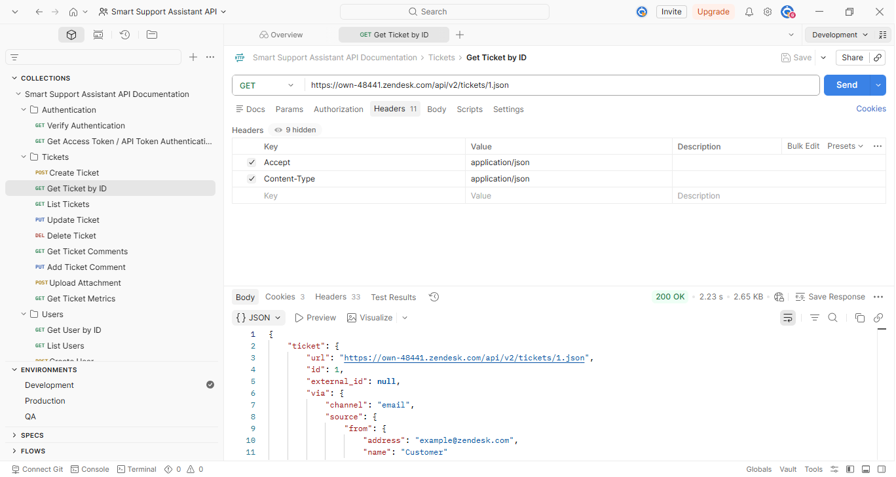

# Postman Guide

## Overview

This guide explains how to use the Smart Support Assistant Postman collection to test Zendesk APIs.

The Postman collection contains requests for searching tickets, retrieving ticket details, retrieving ticket comments, and demonstrating the AI workflow.

---

## Postman Collection

The following screenshot shows the Smart Support Assistant Postman collection organized into folders and API requests.



---
# Prerequisites

Before using the collection, ensure you have:

- A Postman account
- A Zendesk account
- Zendesk API Token
- Zendesk email address
- Zendesk subdomain

Example:

Subdomain

```
https://own-48441.zendesk.com
```

---

# Import the Collection

1. Open Postman.
2. Click **Import**.
3. Select the exported Postman Collection JSON file.
4. The collection will appear in your workspace.

---

# Create an Environment

Create a Postman Environment with the following variables.

| Variable | Description | Example |
|----------|-------------|---------|
| baseUrl | Zendesk domain | https://own-48441.zendesk.com |
| email | Zendesk account email | your-email@example.com |
| apiToken | Zendesk API Token | xxxxxxxxxxxxxxxxx |
| ticketId | Ticket ID | 1 |

---

# Authentication

The collection uses Basic Authentication.

Username

```
email/token
```

Example

```
john@example.com/token
```

Password

```
Zendesk API Token
```

---

# Collection Structure

```
Smart Support Assistant API Documentation

AIWorkflowReference

├── Search Relevant Tickets

├── Retrieve Ticket Details

├── Retrieve Ticket Comments

└── AI Response Flow
```

---

# Running Requests

## Search Relevant Tickets

Purpose

Search tickets related to a user's query.

Example Request

```
GET /api/v2/search.json?query=password
```

---

## Retrieve Ticket Details

Purpose

Retrieve complete information for a ticket.

Example Request

```
GET /api/v2/tickets/{ticket_id}.json
```

---

## Retrieve Ticket Comments

Purpose

Retrieve all comments for a ticket.

Example Request

```
GET /api/v2/tickets/{ticket_id}/comments.json
```

---

## AI Response Flow

Purpose

Demonstrates how the Smart Support Assistant combines API responses to generate an AI-assisted answer.

---

# Running the Collection

1. Select the environment.
2. Open the collection.
3. Click **Run Collection**.
4. Execute the requests in order:

- Search Relevant Tickets
- Retrieve Ticket Details
- Retrieve Ticket Comments
- AI Response Flow

---

# Expected Responses

Successful requests return:

- HTTP Status Code 200
- JSON response body
- Relevant ticket information

---

# Troubleshooting

| Problem | Solution |
|----------|----------|
| 401 Unauthorized | Verify email and API token. |
| 404 Not Found | Verify the ticket ID or endpoint. |
| 429 Too Many Requests | Wait before sending more requests. |
| Network Error | Check your internet connection and Zendesk domain. |

---

# Best Practices

- Always use environment variables instead of hardcoded values.
- Keep API tokens secure.
- Test requests individually before running the full collection.
- Review response status codes after every request.
- Use descriptive request names for easier maintenance.

---

# Summary

This Postman collection provides a structured way to test Zendesk APIs used by the Smart Support Assistant. By executing the requests in sequence, developers can simulate the AI workflow from searching tickets to generating AI-assisted responses. 
