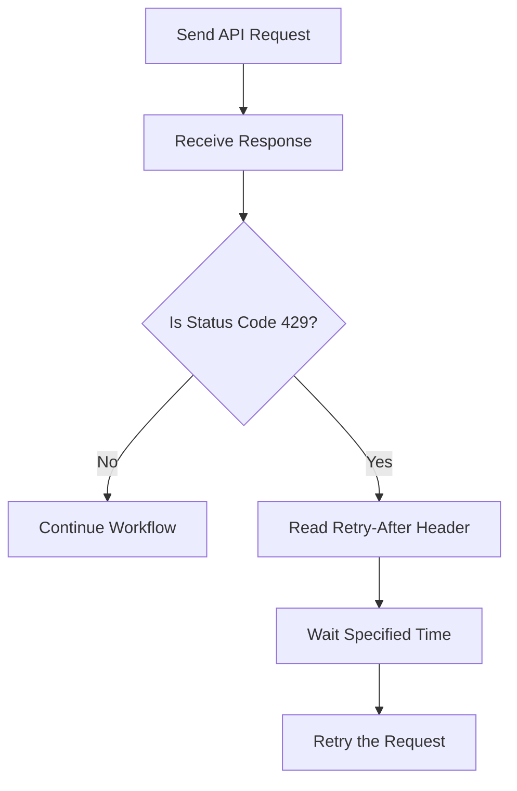

# Rate Limits

## Overview

Zendesk enforces API rate limits to ensure fair usage and maintain system performance. If an application sends too many requests within a short period, the API temporarily rejects additional requests until the limit resets.

This guide explains how rate limits work and how to handle them in the Smart Support Assistant.

---

# Why Rate Limits Exist

Rate limits help to:

- Prevent server overload
- Ensure fair usage among all users
- Protect API performance
- Improve system stability

---

# How Rate Limiting Works

Each API request counts toward your account's request limit.

When the limit is reached:

- Zendesk returns an HTTP **429 Too Many Requests** response.
- Additional requests are rejected until the rate limit resets.

---

# Rate Limit Response

When the rate limit is exceeded, the API returns:

| Status Code | Description |
|-------------|-------------|
| 429 | Too Many Requests |

Example response:

```json
{
  "error": "RateLimitExceeded",
  "description": "Rate limit exceeded. Please retry later."
}
```

---

# Rate Limit Headers

Zendesk includes response headers that provide information about the current rate limit.

| Header | Description |
|---------|-------------|
| X-Rate-Limit | Maximum requests allowed |
| X-Rate-Limit-Remaining | Remaining requests available |
| Retry-After | Number of seconds to wait before retrying |

Example:

```
X-Rate-Limit: 700
X-Rate-Limit-Remaining: 695
Retry-After: 30
```

---

# Handling Rate Limits

When a **429 Too Many Requests** response is received:

1. Stop sending additional requests.
2. Read the **Retry-After** header.
3. Wait for the specified number of seconds.
4. Retry the request.
5. Continue normal processing.

---

# Example Workflow



---

# Best Practices

- Avoid sending unnecessary API requests.
- Cache frequently used data whenever possible.
- Combine requests when appropriate.
- Monitor the remaining request count.
- Respect the **Retry-After** header.
- Implement automatic retry logic with delays.
- Avoid sending multiple simultaneous requests when possible.

---

# Recommendations for Smart Support Assistant

To improve performance and reduce the chance of hitting rate limits:

- Search for relevant tickets before requesting ticket details.
- Retrieve comments only for selected tickets.
- Reuse previously retrieved data whenever possible.
- Minimize duplicate API calls.
- Handle rate limit responses gracefully.

---

# Summary

Zendesk API rate limits help maintain reliable service for all users. The Smart Support Assistant should monitor rate limit headers, avoid excessive requests, and automatically retry requests after the recommended waiting period to ensure smooth and reliable API communication.