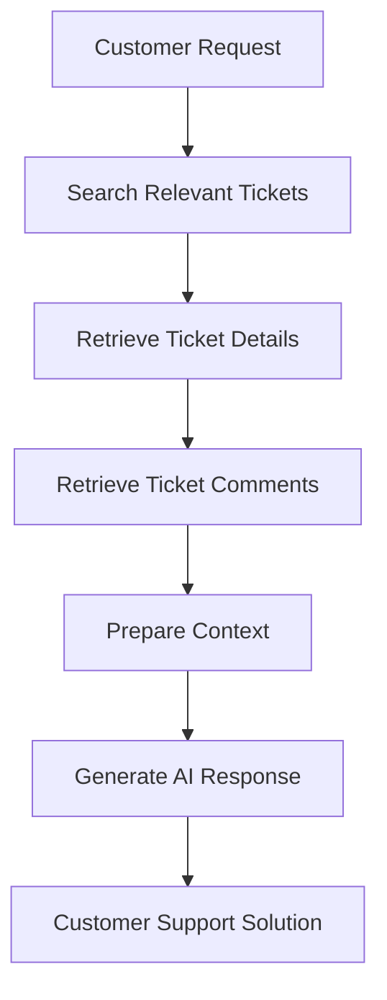

# Smart Support Assistant API Documentation

Welcome to the **Smart Support Assistant API Documentation**.

This documentation provides complete reference material for integrating with the Zendesk-based Smart Support Assistant platform.

---

## Overview

Smart Support Assistant is an AI-powered support automation system built using Zendesk APIs.

It enables applications to:

- Create and manage support tickets
- Retrieve ticket information
- Manage users and organizations
- Search support data
- Automate support workflows
- Generate AI-assisted responses
- Improve customer support operations using AI workflows

---

## API Base URL

All API requests should be sent to the following base URL:

```text
https://own-48441.zendesk.com/api/v2
```

Example API request:

```http
GET https://own-48441.zendesk.com/api/v2/tickets.json
```

---

## Authentication

The Smart Support Assistant API uses Zendesk API authentication.

Supported authentication methods:

- API Token Authentication
- Basic Authentication

All API requests require authentication headers.

Example:

```http
Authorization: Basic <encoded_credentials>
Content-Type: application/json
```

For detailed authentication information, refer to:

[Authentication Guide](apis/authentication.md)

---

## API Modules

The API documentation is organized into the following modules:

| Module | Description |
|---|---|
| Authentication | API authentication and verification |
| Tickets | Create, retrieve, update, delete and manage support tickets |
| Users | User management operations |
| Organizations | Organization management operations |
| Search | Search tickets, users and organizations |
| Views | Manage Zendesk views |
| Macros | Manage and execute predefined actions |
| Triggers | Manage automation triggers |
| AI Workflow | AI-powered ticket analysis and response workflow |
| Utilities | Health checks, rate limits and error examples |

---

## Quick Example

### Get Tickets

Example request:

```bash
curl --request GET \
https://own-48441.zendesk.com/api/v2/tickets.json \
--header "Authorization: Basic <token>" \
--header "Content-Type: application/json"
```

Example response:

```json
{
  "tickets": [
    {
      "id": 1,
      "subject": "Sample Support Ticket",
      "status": "open"
    }
  ]
}
```

---

## Documentation Structure

Use the navigation menu to explore the complete API documentation.

The documentation contains:

### Introduction

- Project Overview
- System Overview
- Architecture Design

### Authentication

- API Token Authentication
- Authentication Verification

### API Reference

- Ticket APIs
- User APIs
- Organization APIs
- Search APIs
- View APIs
- Macro APIs
- Trigger APIs

### AI Workflow

- Search Relevant Tickets
- Retrieve Ticket Details
- Retrieve Ticket Comments
- AI Response Generation Flow

### Developer Guides

- Postman Collection Guide
- Error Handling
- Rate Limits
- Best Practices

### Reference

- HTTP Status Codes
- Glossary
- FAQ
- Changelog

---

## AI Workflow Overview

Smart Support Assistant uses AI workflows to improve customer support operations.

High-level flow:



---

## Support

For API integration issues, authentication problems, or implementation questions, refer to:

- Authentication Guide
- API Reference
- Error Handling Guide
- FAQ
- Best Practices

---

## Version Information

Current Documentation Version:

```
v1.0.0
```

Last Updated:

```
July 2026
``` 
